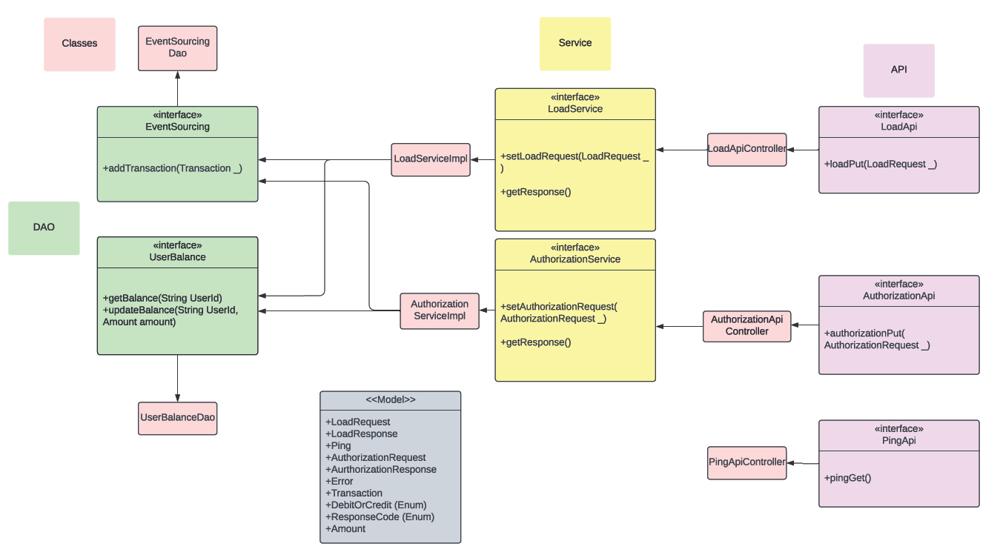

**Important: Don't forget to update the [Candidate README](#candidate-readme) section**

Real-time Transaction Challenge
===============================
## Overview
Welcome to Current's take-home technical assessment for backend engineers! We appreciate you taking the time to complete this, and we're excited to see what you come up with.

You are tasked with building a simple bank ledger system that utilizes the [event sourcing](https://martinfowler.com/eaaDev/EventSourcing.html) pattern to maintain a transaction history. The system should allow users to perform basic banking operations such as depositing funds, withdrawing funds, and checking balances. The ledger should maintain a complete and immutable record of all transactions, enabling auditability and reconstruction of account balances at any point in time.

## Details
The [included service.yml](service.yml) is the OpenAPI 3.0 schema to a service we would like you to create and host.

The service accepts two types of transactions:
1) Loads: Add money to a user (credit)

2) Authorizations: Conditionally remove money from a user (debit)

Every load or authorization PUT should return the updated transactionAmount following the transaction. Authorization declines should be saved, even if they do not impact transactionAmount calculation.

Implement the event sourcing pattern to record all banking transactions as immutable events. Each event should capture relevant information such as transaction type, amount, timestamp, and account identifier.
Define the structure of events and ensure they can be easily serialized and persisted to a data store of your choice. We do not expect you to use a persistent store (you can you in-memory object), but you can if you want. We should be able to bootstrap your project locally to test.

## Expectations
We are looking for attention in the following areas:
1) Do you accept all requests supported by the schema, in the format described?

2) Do your responses conform to the prescribed schema?

3) Does the authorizations endpoint work as documented in the schema?

4) Do you have unit and integrations test on the functionality?

Here’s a breakdown of the key criteria we’ll be considering when grading your submission:

**Adherence to Design Patterns:** We’ll evaluate whether your implementation follows established design patterns such as following the event sourcing model.

**Correctness**: We’ll assess whether your implementation effectively implements the desired pattern and meets the specified requirements.

**Testing:** We’ll assess the comprehensiveness and effectiveness of your test suite, including unit tests, integration tests, and possibly end-to-end tests. Your tests should cover critical functionalities, edge cases, and potential failure scenarios to ensure the stability of the system.

**Documentation and Clarity:** We’ll assess the clarity of your documentation, including comments within the code, README files, architectural diagrams, and explanations of design decisions. Your documentation should provide sufficient context for reviewers to understand the problem, solution, and implementation details.

# Candidate README
## Bootstrap instructions
To run this server locally, clone the repository.
Navigate to the project directory and run the application with the command

mvn spring-boot:run

Curl to port 8080 with the respective schema or use Postman.  

## Design considerations
I decided to have a linked list to store the transactions because we need
a serial order of transactions stored such that it is immutable and auditable. I 
decided to have a simple hashmap to store user balances to ensure fast access (O(1)).
I decide to have interfaces allowing to switch between future implementations. (For example a database)
The following is the design of the application:

## Assumptions
I assumed that the amount is given in such way that the balance amount never goes above the maximum limit of double.
Working with double may introduce slight errors in calculation but this should not affect the results
as the errors are generally in later places of decimals. We can bypass double implementation by performing 
string additions rather than double additions or having types that can store larger numbers. 
I've performed basic error handling in the requests but for intricate cases such as only allowing
valid currency, we need more logic. I'm assuming I don't need to bother about these cases for now. 
I'm also assuming I don't need to handle concurrency for now. 

## Bonus: Deployment considerations
To deploy the application on for instance, let's say AWS, 

EC2 Instances: Provision EC2 instances to host our application, ensuring that we select 
appropriate instance types and configure security groups to allow HTTP traffic.

VPC Configuration: Set up a Virtual Private Cloud (VPC) to define our network
environment, including security groups for controlling inbound and outbound traffic.

Database Consideration: Although we're using in-built data structures like hashmap
or linked list, we need to ensure that the state of the database objects remains clean 
and consistent across instances. One approach to would be to implement RDS.

Application Deployment: Package our application into a JAR file and deploy it 
to EC2 instances using SSH. 

Load Balancing: Configure an Elastic Load Balancer (ELB) to distribute 
incoming traffic across multiple EC2 instances, ensuring scalability and high availability.
Setup health check ups for the same. 

Monitoring with CloudWatch: Monitor our EC2 instances, load balancers, and
other AWS resources using Amazon CloudWatch to detect and troubleshoot issues. Alerts can
be configured accordingly.
## License

At CodeScreen, we strongly value the integrity and privacy of our assessments. As a result, this repository is under exclusive copyright, which means you **do not** have permission to share your solution to this test publicly (i.e., inside a public GitHub/GitLab repo, on Reddit, etc.).  

## Submitting your solution

Please push your changes to the `main branch` of this repository. You can push one or more commits.  

Once you are finished with the task, please click the `Submit Solution` link on <a href="https://app.codescreen.com/candidate/6da4bf99-ba4c-452f-b047-d6459b5281e4" target="_blank">this screen</a>.